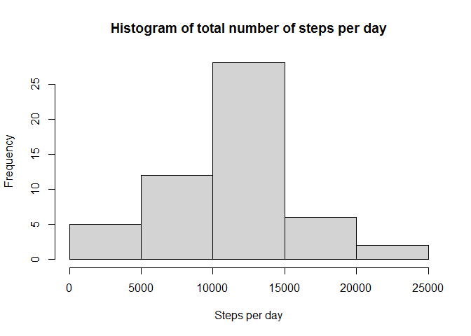
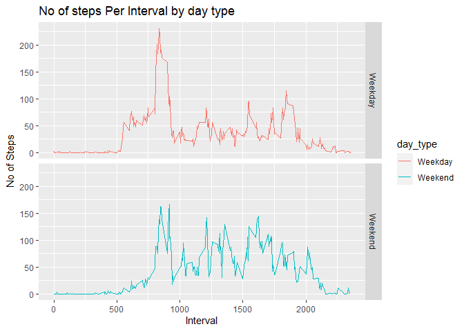

## Loading and preprocessing the data

Show any code that is needed to

1. Load the data (i.e. read.csv())

2. Process/transform the data (if necessary) into a format suitable for your analysis

```r
# Load the data file into a data frame
activity <- read.csv("activity.csv", as.is = TRUE)

# create a new dataset removing NA values
newactivity <- activity[complete.cases(activity), ]

head(activity)
```

```
##   steps       date interval
## 1    NA 2012-10-01        0
## 2    NA 2012-10-01        5
## 3    NA 2012-10-01       10
## 4    NA 2012-10-01       15
## 5    NA 2012-10-01       20
## 6    NA 2012-10-01       25
```


## What is mean total number of steps taken per day?
For this part of the assignment, you can ignore the missing values in the dataset.

1. Make a histogram of the total number of steps taken each day


```r
# Calculate the total number of steps taken per day
steps_per_day <- aggregate(steps ~ date, newactivity, sum)

# Histogram showing no of steps per day
hist(steps_per_day$steps, main = "Histogram of total number of steps per day", xlab = "Steps per day")
```

<!-- -->

2. Calculate and report the mean and median total number of steps taken per day

```r
# Calculate the mean and median of the total number of steps taken per day
round(mean(steps_per_day$steps))
```

```
## [1] 10766
```

```r
median(steps_per_day$steps)
```

```
## [1] 10765
```


## What is the average daily activity pattern?
1. Make a time series plot (i.e. type = "l") of the 5-minute interval (x-axis) and the average number of steps taken, averaged across all days (y-axis)


```r
# Average steps per interval for all days 
avg_steps_per_interval <- aggregate(steps ~ interval, newactivity, mean)

# Average steps per day for all intervals
avg_steps_per_day <- aggregate(steps ~ date, newactivity, mean)

# Plot a time series
plot(avg_steps_per_interval$interval, avg_steps_per_interval$steps, type='l', col=1, main="Average number of steps by Interval", xlab="Time Intervals", ylab="Average number of steps")
```

<!-- -->


2. Which 5-minute interval, on average across all the days in the dataset, contains the maximum number of steps?

```r
# Identify the interval index with the highest average steps
interval_idx <- which.max(avg_steps_per_interval$steps)

# Identify the specific interval and the average steps for that interval
print (paste("The interval with the highest avg steps is ", avg_steps_per_interval[interval_idx, ]$interval, " and the no of steps for that interval is ", round(avg_steps_per_interval[interval_idx, ]$steps, digits = 1)))
```

```
## [1] "The interval with the highest avg steps is  835  and the no of steps for that interval is  206.2"
```

## Imputing missing values
Note that there are a number of days/intervals where there are missing values (coded as NA). The presence of missing days may introduce bias into some calculations or summaries of the data.

1. Calculate and report the total number of missing values in the dataset (i.e. the total number of rows with NAs)

```r
# Calculate the number of rows with missing values
missing_value_act <- activity[!complete.cases(activity), ]
nrow(missing_value_act)
```

```
## [1] 2304
```


2. Devise a strategy for filling in all of the missing values in the dataset. The strategy does not need to be sophisticated. For example, you could use the mean/median for that day, or the mean for that 5-minute interval, etc.

```r
# For each NA value, it will be substituted by the avg steps
for (i in 1:nrow(activity)) {
    if(is.na(activity$steps[i])) {
        val <- avg_steps_per_interval$steps[which(avg_steps_per_interval$interval == activity$interval[i])]
        activity$steps[i] <- val 
    }
}
```


3. Create a new dataset that is equal to the original dataset but with the missing data filled in.

```r
# New dataset including missing data filled in
steps_per_day_impute <- aggregate(steps ~ date, activity, sum)
```


4. Make a histogram of the total number of steps taken each day and Calculate and report the mean and median total number of steps taken per day. Do these values differ from the estimates from the first part of the assignment? What is the impact of imputing missing data on the estimates of the total daily number of steps?

```r
# Historgram of the total number of steps taken each day 
hist(steps_per_day_impute$steps, main = "Histogram of total number of steps per day (IMPUTED)", xlab = "Steps per day")
```

<!-- -->

```r
#Calculate and report the mean and median total number of steps taken per day
round(mean(steps_per_day_impute$steps))
```

```
## [1] 10766
```

```r
median(steps_per_day_impute$steps)
```

```
## [1] 10766.19
```
There is no significance difference between mean or median compare with the previous calculation without missing values

## Are there differences in activity patterns between weekdays and weekends?
For this part the weekdays() function may be of some help here. Use the dataset with the filled-in missing values for this part.

1. Create a new factor variable in the dataset with two levels -- "weekday" and "weekend" indicating whether a given date is a weekday or weekend day.


```r
#Function to determine if the date is a weekday
week_day <- function(date_val) {
    wd <- weekdays(as.Date(date_val, '%Y-%m-%d'))
    if  (!(wd == 'Saturday' || wd == 'Sunday')) {
        x <- 'Weekday'
    } else {
        x <- 'Weekend'
    }
    x
}
```


```r
# Applying week_day function on the dataset and adding new column with the weekday or weekend value.
activity$day_type <- as.factor(sapply(activity$date, week_day))
```


2. Make a panel plot containing a time series plot (i.e. type = "l") of the 5-minute interval (x-axis) and the average number of steps taken, averaged across all weekday days or weekend days (y-axis).

```r
library(ggplot2)

# Aggregated data frame by intervals and day_type
steps_per_day_impute <- aggregate(steps ~ interval+day_type, activity, mean)

# Create the plot
plt <- ggplot(steps_per_day_impute, aes(interval, steps)) +
    geom_line(stat = "identity", aes(colour = day_type)) +
    theme_gray() +
    facet_grid(day_type ~ ., scales="fixed", space="fixed") +
    labs(x="Interval", y=expression("No of Steps")) +
    ggtitle("No of steps Per Interval by day type")
print(plt)
```

<!-- -->


